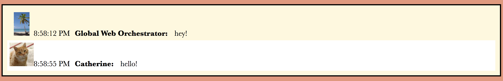

# Code Fellows: Seattle 401 JavaScript - 401d19

## Lab 41: Socket IO with Vanilla JS



### Author: 
Catherine Looper

### Motivation

This application is a simple chat website built with Vanilla JavaScript. Users can enter the chat, send messages, update their username and update their avatar.

The messages display the users avatar, a timestamp (when the message was sent), the username, and the message itself.

### Build

The chat message model contains the following properties: 

```
class ChatMessage {
  constructor(message) {
    this.timestamp = message.timestamp;
    this.username = message.username;
    this.message = message.message;
    this.avatar = message.avatar;
  }
}

```

### Limitations

To use this app - it is assumed that the user has familiarity with the tech and frameworks listed below.

### Code Style

Standard JavaScript with ES6.

### Tech/Framework Used

* eslint
* socket-io
* express
* faker

### How to use?

* Step 1. Fork and Clone the Repository.
* Step 2. `npm install`
* Step 3. Run `nodemon` 

### Credits

* Code Fellows

### License

MIT © Catherine Looper

